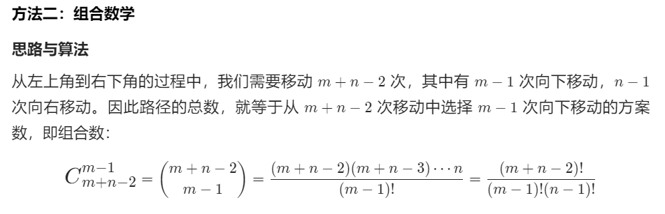

- [字符串](#字符串)
    - [3. 无重复字符的最长子串](#3-无重复字符的最长子串)
    - [5. 最长回文子串](#5-最长回文子串)
    - [20. 有效的括号](#20-有效的括号)
    - [49. 字母异位词分组](#49-字母异位词分组)
    - [139. 单词拆分](#139-单词拆分)
    - [647. 回文子串](#647-回文子串)
    - [1249. 移除无效的括号](#1249-移除无效的括号)
    - [面试题 01.06. 字符串压缩](#面试题-0106-字符串压缩)
    - [567. 字符串的排列](#567-字符串的排列)
    - [1544. 整理字符串](#1544-整理字符串)
    - [面试题 08.09. 括号](#面试题-0809-括号)
    - [227. 基本计算器 II](#227-基本计算器-ii)
- [深度优先](#深度优先)
  - [**<u>E</u>**](#ueu)
    - [226. 翻转二叉树](#226-翻转二叉树)
    - [104. 二叉树的最大深度](#104-二叉树的最大深度)
    - [101. 对称二叉树](#101-对称二叉树)
  - [**<u>M</u>**](#umu)
    - [114. 二叉树展开为链表](#114-二叉树展开为链表)
    - [199. 二叉树的右视图](#199-二叉树的右视图)
    - [207. 课程表](#207-课程表)
    - [剑指 Offer 12. 矩阵中的路径](#剑指-offer-12-矩阵中的路径)
    - [剑指 Offer 34. 二叉树中和为某一值的路径](#剑指-offer-34-二叉树中和为某一值的路径)
    - [200. 岛屿数量](#200-岛屿数量)
    - [695. 岛屿的最大面积](#695-岛屿的最大面积)
- [数组](#数组)
  - [E](#e)
    - [53. 最大子序和](#53-最大子序和)
    - [121. 买卖股票的最佳时机](#121-买卖股票的最佳时机)
    - [169. 多数元素](#169-多数元素)
    - [268. 丢失的数字](#268-丢失的数字)
    - [283. 移动零](#283-移动零)
  - [<u>M</u>](#umu-1)
    - [11. 盛最多水的容器](#11-盛最多水的容器)
    - [15. 三数之和](#15-三数之和)
    - [31. 下一个排列](#31-下一个排列)
    - [48. 旋转图像](#48-旋转图像)
    - [55. 跳跃游戏](#55-跳跃游戏)
    - [59. 螺旋矩阵 II](#59-螺旋矩阵-ii)
    - [56. 合并区间](#56-合并区间)
    - [62. 不同路径](#62-不同路径)
    - [64. 最小路径和](#64-最小路径和)
    - [74. 搜索二维矩阵](#74-搜索二维矩阵)
    - [75. 颜色分类](#75-颜色分类)
    - [78. 子集](#78-子集)
    - [216. 组合总和 III](#216-组合总和-iii)
    - [287. 寻找重复数](#287-寻找重复数)
    - [238. 除自身以外数组的乘积](#238-除自身以外数组的乘积)
- [栈](#栈)
  - [**<u>E</u>**](#ueu-1)
    - [155. 最小栈](#155-最小栈)
  - [**<u>M</u>**](#umu-2)
    - [150. 逆波兰表达式求值](#150-逆波兰表达式求值)
    - [227. 基本计算器 II](#227-基本计算器-ii-1)
    - [394. 字符串解码](#394-字符串解码)
    - [856. 括号的分数](#856-括号的分数)
    - [739. 每日温度](#739-每日温度)
- [排序](#排序)
- [链表](#链表)
    - [21. 合并两个有序链表](#21-合并两个有序链表)
    - [19. 删除链表的倒数第 N 个结点](#19-删除链表的倒数第-n-个结点)
## 字符串

#### [3. 无重复字符的最长子串](https://leetcode-cn.com/problems/longest-substring-without-repeating-characters/)

难度中等5626收藏分享切换为英文接收动态反馈

给定一个字符串，请你找出其中不含有重复字符的 **最长子串** 的长度。

**示例 1:**

```
输入: s = "abcabcbb"
输出: 3 
解释: 因为无重复字符的最长子串是 "abc"，所以其长度为 3。
```

**示例 2:**

```
输入: s = "bbbbb"
输出: 1
解释: 因为无重复字符的最长子串是 "b"，所以其长度为 1。
```

**示例 3:**

```
输入: s = "pwwkew"
输出: 3
解释: 因为无重复字符的最长子串是 "wke"，所以其长度为 3。
     请注意，你的答案必须是 子串 的长度，"pwke" 是一个子序列，不是子串。
```

**示例 4:**

```
输入: s = ""
输出: 0
```

```Java
import java.util.HashMap;
import java.util.Map;
class Solution {
    public int lengthOfLongestSubstring(String s) {
        int n = s.length(), ans = 0;
        Map<Character, Integer> map = new HashMap<>();
        for (int end = 0, start = 0; end < n; end++) {
            char alpha = s.charAt(end);
            if (map.containsKey(alpha)) {
            	// 更新左边的指针
                start = Math.max(map.get(alpha), start);
            }
            ans = Math.max(ans, end - start + 1);
            // 添加新元素到Map；更新Map的中相同元素的最新位置
            map.put(s.charAt(end), end + 1); 
        }
        return ans;
    }
}
```

#### [5. 最长回文子串](https://leetcode-cn.com/problems/longest-palindromic-substring/)

难度中等3738收藏分享切换为英文接收动态反馈

给你一个字符串 `s`，找到 `s` 中最长的回文子串。

**示例 1：**

```
输入：s = "babad"
输出："bab"
解释："aba" 同样是符合题意的答案。
```

**示例 2：**

```
输入：s = "cbbd"
输出："bb"
```

**示例 3：**

```
输入：s = "a"
输出："a"
```

**示例 4：**

```
输入：s = "ac"
输出："a"
```

==暴力法==

```Java
import java.util.HashMap;
import java.util.Map;

class Solution {
	public boolean isPalindromic(String s) {
		int len = s.length();
		for (int i = 0; i < len / 2; i++) {
			if (s.charAt(i) != s.charAt(len - i - 1)) {
				return false;
			}
		}
		return true;
	}

	// 暴力解法
	public String longestPalindrome(String s) {
		String ans = "";
		int max = 0;
		int len = s.length();
		for (int i = 0; i < len; i++)
			for (int j = i + 1; j <= len; j++) {
				String test = s.substring(i, j);
				if (isPalindromic(test) && test.length() > max) {
					ans = s.substring(i, j);
					max = Math.max(max, ans.length());
				}
			}
		return ans;
	}
}
```

子串：s.substring(i, j);

String reverse = new StringBuffer(s).reverse().toString(); //字符串倒置

#### [20. 有效的括号](https://leetcode-cn.com/problems/valid-parentheses/)

难度简单2456收藏分享切换为英文接收动态反馈

给定一个只包括 `'('`，`')'`，`'{'`，`'}'`，`'['`，`']'` 的字符串 `s` ，判断字符串是否有效。

有效字符串需满足：

1. 左括号必须用相同类型的右括号闭合。
2. 左括号必须以正确的顺序闭合。

**示例 1：**

```
输入：s = "()"
输出：true
```

**示例 2：**

```
输入：s = "()[]{}"
输出：true
```

**示例 3：**

```
输入：s = "(]"
输出：false
```

**示例 4：**

```
输入：s = "([)]"
输出：false
```

**示例 5：**

```
输入：s = "{[]}"
输出：true
```

==栈==

```java
import java.util.HashMap;
import java.util.Stack;

class Solution {
    public boolean isValid(String s) {
        HashMap<Character, Integer> map = new HashMap<Character,Integer>();
        map.put('(', 1);
        map.put('[', 2);
        map.put('{', 3);
        map.put(')', 4);
        map.put(']', 5);
        map.put('}', 6);
        Stack<Character> st = new Stack<Character>();
        for(int i=0;i<s.length();i++){
        	// 左括号 入栈
        	if(1<= map.get(s.charAt(i)) && map.get(s.charAt(i))<=3)
        		st.push(s.charAt(i));
        	// 右括号，出栈
        	else if(!st.empty() && map.get(st.peek()) == map.get(s.charAt(i))-3)
        		st.pop();
        	else 
        		return false;
        }
        if(!st.empty())
        	return false;
        return true;
    }
}
```

#### [49. 字母异位词分组](https://leetcode-cn.com/problems/group-anagrams/)

难度中等763收藏分享切换为英文接收动态反馈

<u>给定一个字符串数组，将字母异位词组合在一起。字母异位词指字母相同，但排列不同的字符串。</u>

**示例:**

```
输入: ["eat", "tea", "tan", "ate", "nat", "bat"]
输出:
[
  ["ate","eat","tea"],
  ["nat","tan"],
  ["bat"]
]
```

```Java
// 排序 + 哈希
class Solution {
    public List<List<String>> groupAnagrams(String[] strs) {
    HashMap<String, List<String>> hash = new HashMap<>();
    for (int i = 0; i < strs.length; i++) {
        char[] s_arr = strs[i].toCharArray(); // 转成char[]
        //排序
        Arrays.sort(s_arr);                   // 排序
        //映射到 key
        String key = String.valueOf(s_arr);   // 转成string类型
        //添加到对应的类中
        if (hash.containsKey(key)) {          // 如果排序后的字符串以前有一样的
            hash.get(key).add(strs[i]);       // 先找到那个，然后添加进去
        } else {                              // 第一次出现
            List<String> temp = new ArrayList<String>();  // 新建一个List
            temp.add(strs[i]);                 
            hash.put(key, temp);
        }
    }
    return new ArrayList<List<String>>(hash.values());// 将hashMap中的值Value放入List
  }
}
```

#### [139. 单词拆分](https://leetcode-cn.com/problems/word-break/)

难度中等1033收藏分享切换为英文接收动态反馈

给定一个**非空**字符串 *s* 和一个包含**非空**单词的列表 *wordDict*，判定 *s* 是否可以被空格拆分为一个或多个在字典中出现的单词。

**说明：**

- 拆分时可以重复使用字典中的单词。
- 你可以假设字典中没有重复的单词。

**示例 1：**

```
输入: s = "leetcode", wordDict = ["leet", "code"]
输出: true
解释: 返回 true 因为 "leetcode" 可以被拆分成 "leet code"。
```

**示例 2：**

```
输入: s = "applepenapple", wordDict = ["apple", "pen"]
输出: true
解释: 返回 true 因为 "applepenapple" 可以被拆分成 "apple pen apple"。
     注意你可以重复使用字典中的单词。
```

**示例 3：**

```
输入: s = "catsandog", wordDict = ["cats", "dog", "sand", "and", "cat"]
输出: false
```

**<u>背包问题：https://leetcode-cn.com/problems/word-break/solution/yi-tao-kuang-jia-jie-jue-bei-bao-wen-ti-kchg9/</u>**

```Java
class Solution {
public:
   string slice(string s ,int m,int n)
{
	string tmp= "";
	for(int i = m;i<=n;i++)
		tmp.push_back(s[i]);
	return tmp;
}
bool wordBreak(string s, vector<string>& wordDict)
{
	int n = s.size();
	 bool *dp = (bool*)malloc(sizeof(bool)*(n+1));  //dp数组
    //bool dp[n+1] ;
	for(int i=0;i<=n;i++)
		dp[i] = false;
	dp[0] = true;  // 边界条件
	for(int i = 1;i<=n;i++){	// dp数组的赋值
		for(int j=i-1;j>=0;j--){
			string split = slice(s,j,i-1);  // 后缀部分s[j:i-1]
			auto res = find(wordDict.begin(), wordDict.end(),split); //查找leet
			if(res!=wordDict.end() && dp[j])
			{
				dp[i] = true;
				break;
			}
		}
	}
	return dp[n];
  }
};
```


#### [647. 回文子串](https://leetcode-cn.com/problems/palindromic-substrings/)

难度中等611收藏分享切换为英文接收动态反馈

给定一个字符串，你的任务是计算这个字符串中有多少个回文子串。

具有不同开始位置或结束位置的子串，即使是由相同的字符组成，也会被视作不同的子串。

**示例 1：**

```
输入："abc"
输出：3
解释：三个回文子串: "a", "b", "c"
```

**示例 2：**

```
输入："aaa"
输出：6
解释：6个回文子串: "a", "a", "a", "aa", "aa", "aaa"
```

==暴力==

```Java
class Solution {
    // 判断是否回文
    boolean isHuiWen(String str){
        int len = str.length();
        for(int i = 0 ;i < len/2;i++){
            if(str.charAt(i) != str.charAt(len-1-i))
                return false;
        }
        return true;
    }    
    public int countSubstrings(String s) {
        int length = s.length();
        if(length == 1)
            return 1;
        if(length == 0){
            return 0;
        }
        int res = 0;
        for(int i=0;i<length;i++){
            for(int j = i+1;j<=length;j++){
                String t = s.substring(i,j);
                if(isHuiWen(t)){
                    res = res + 1;
                }
            }
        }
        return res;
    }
}
```

#### [1249. 移除无效的括号](https://leetcode-cn.com/problems/minimum-remove-to-make-valid-parentheses/)

难度中等114收藏分享切换为英文接收动态反馈

给你一个由 `'('`、`')'` 和小写字母组成的字符串 `s`。

你需要从字符串中删除最少数目的 `'('` 或者 `')'` （可以删除任意位置的括号)，使得剩下的「括号字符串」有效。

请返回任意一个合法字符串。

有效「括号字符串」应当符合以下 **任意一条** 要求：

- 空字符串或只包含小写字母的字符串
- 可以被写作 `AB`（`A` 连接 `B`）的字符串，其中 `A` 和 `B` 都是有效「括号字符串」
- 可以被写作 `(A)` 的字符串，其中 `A` 是一个有效的「括号字符串」

**示例 1：**

```
输入：s = "lee(t(c)o)de)"
输出："lee(t(c)o)de"
解释："lee(t(co)de)" , "lee(t(c)ode)" 也是一个可行答案。
```

**示例 2：**

```
输入：s = "a)b(c)d"
输出："ab(c)d"
```

**示例 3：**

```
输入：s = "))(("
输出：""
解释：空字符串也是有效的
```

**示例 4：**

```
输入：s = "(a(b(c)d)"
输出："a(b(c)d)"
```

==栈==

- 利用类似括号匹配的思想，找到不能匹配的括号的索引，用一个Set存起来
- 将Set索引对应的字符从String中删除

```Java
class Solution {
    public String minRemoveToMakeValid(String s) {
        Set<Integer> indexesToRemove = new HashSet<>();
        Stack<Integer> stack = new Stack<>();
        for (int i = 0; i < s.length(); i++) {
            if (s.charAt(i) == '(') {
                stack.push(i);
            } if (s.charAt(i) == ')') {
                if (stack.isEmpty()) {
                    indexesToRemove.add(i);
                } else {
                    stack.pop();
                }
            }
        }
        // Put any indexes remaining on stack into the set.
        while (!stack.isEmpty()) indexesToRemove.add(stack.pop());
        StringBuilder sb = new StringBuilder();
        for (int i = 0; i < s.length(); i++) {
            if (!indexesToRemove.contains(i)) {
                sb.append(s.charAt(i));
            }
        }
        return sb.toString();
    }
}
```

#### [面试题 01.06. 字符串压缩](https://leetcode-cn.com/problems/compress-string-lcci/)

难度简单89收藏分享切换为英文接收动态反馈

字符串压缩。利用字符重复出现的次数，编写一种方法，实现基本的字符串压缩功能。比如，字符串`aabcccccaaa`会变为`a2b1c5a3`。若“压缩”后的字符串没有变短，则返回原先的字符串。你可以假设字符串中只包含大小写英文字母（a至z）。

**示例1:**

```
 输入："aabcccccaaa"
 输出："a2b1c5a3"
```

**示例2:**

```
 输入："abbccd"
 输出："abbccd"
 解释："abbccd"压缩后为"a1b2c2d1"，比原字符串长度更长。
```

```Java
class Solution {
    public String compressString(String S) {
        if(S.length() == 0 || S.length()==1){
            return S;
        }
        StringBuffer ans = new StringBuffer();
        String s3 = S;
        StringBuffer s2 = new StringBuffer(s3);
        s2.append("*");
        int count = 1;
        for(int i=0;i<s2.length()-1;i++){
            if(s2.charAt(i) == s2.charAt(i+1)){
                count++;
            }
            else{
                ans.append(s2.charAt(i));
                ans.append(count);
                count = 1;
            }
        }
        String ans2 = ans.toString();
        if(ans2.length() < S.length())
            return ans2;
        return S;
    }
}
```

#### [567. 字符串的排列](https://leetcode-cn.com/problems/permutation-in-string/)

难度中等368收藏分享切换为英文接收动态反馈

给定两个字符串 `s1` 和 `s2`，写一个函数来判断 `s2` 是否包含 `s1` 的排列。

换句话说，第一个字符串的排列之一是第二个字符串的 **子串** 。

**示例 1：**

```
输入: s1 = "ab" s2 = "eidbaooo"
输出: True
解释: s2 包含 s1 的排列之一 ("ba").
```

**示例 2：**

```
输入: s1= "ab" s2 = "eidboaoo"
输出: False
```

```Java
/**
 * 思路：先求取字符串的排列，存在一个List中
  然后使用indecOf()函数进行查找
 *
 */
```


#### [1544. 整理字符串](https://leetcode-cn.com/problems/make-the-string-great/)

难度简单27收藏分享切换为英文接收动态反馈

给你一个由大小写英文字母组成的字符串 `s` 。

一个整理好的字符串中，两个相邻字符 `s[i]` 和 `s[i+1]`，其中 `0<= i <= s.length-2` ，要满足如下条件:

- 若 `s[i]` 是小写字符，则 `s[i+1]` 不可以是相同的大写字符。
- 若 `s[i]` 是大写字符，则 `s[i+1]` 不可以是相同的小写字符。

请你将字符串整理好，每次你都可以从字符串中选出满足上述条件的 **两个相邻** 字符并删除，直到字符串整理好为止。

请返回整理好的 **字符串** 。题目保证在给出的约束条件下，测试样例对应的答案是唯一的。

**注意：**空字符串也属于整理好的字符串，尽管其中没有任何字符。

**示例 1：**

```
输入：s = "leEeetcode"
输出："leetcode"
解释：无论你第一次选的是 i = 1 还是 i = 2，都会使 "leEeetcode" 缩减为 "leetcode" 。
```

**示例 2：**

```
输入：s = "abBAcC"
输出：""
解释：存在多种不同情况，但所有的情况都会导致相同的结果。例如：
"abBAcC" --> "aAcC" --> "cC" --> ""
"abBAcC" --> "abBA" --> "aA" --> ""
```

**示例 3：**

```
输入：s = "s"
输出："s"
```

==栈==

```Java
class Solution {
    public String makeGood(String s) {
        Stack<Character> st = new Stack<Character>();
        for(int i=0;i<s.length();i++){
            if(st.empty()){
                st.push(s.charAt(i));
            }else{
                char c = st.peek();
                if(Math.abs(c-s.charAt(i))==32){
                    st.pop();
                }
                else{
                    st.push(s.charAt(i));
                }
            }
        }
        StringBuffer sb = new StringBuffer();
        while (!st.isEmpty()) {
            sb.insert(0, st.pop());
        }
        return sb.toString();
    }
}
```

#### [面试题 08.09. 括号](https://leetcode-cn.com/problems/bracket-lcci/)

难度中等71收藏分享切换为英文接收动态反馈

括号。设计一种算法，打印n对括号的所有合法的（例如，开闭一一对应）组合。

说明：解集不能包含重复的子集。

例如，给出 n = 3，生成结果为：

```
[
  "((()))",
  "(()())",
  "(())()",
  "()(())",
  "()()()"
]
```

```Java
参考：
https://leetcode-cn.com/problems/bracket-lcci/solution/shu-ju-jie-gou-he-suan-fa-di-gui-he-dong-8ywv/    

	public List<String> generateParenthesis(int n) {
        List<String> res = new ArrayList<>();
        dfs(res, n, n, "");
        return res;
    }

    private void dfs(List<String> res, int left, int right, String curStr) {
        if (left == 0 && right == 0) { // 左右括号都不剩余了，说明找到了有效的括号
            res.add(curStr);
            return;
        }
        //左括号只有剩余的时候才可以选，如果左括号的数量已经选完了，是不能再选左括号了。
        //如果选完了左括号我们是还可以选择右括号的。
        if (left < 0)
            return;
        // 如果右括号剩余数量小于左括号剩余的数量，说明之前选择的无效
        if (right < left)
            return;
        //选择左括号
        dfs(res, left - 1, right, curStr + "(");
        //选择右括号
        dfs(res, left, right - 1, curStr + ")");
    }
```

#### [227. 基本计算器 II](https://leetcode-cn.com/problems/basic-calculator-ii/)

难度中等410收藏分享切换为英文接收动态反馈

给你一个字符串表达式 `s` ，请你实现一个基本计算器来计算并返回它的值。

整数除法仅保留整数部分。

**示例 1：**

```
输入：s = "3+2*2"
输出：7
```

**示例 2：**

```
输入：s = " 3/2 "
输出：1
```

**示例 3：**

```
输入：s = " 3+5 / 2 "
输出：5
```

```Java
// 栈
class Solution {
    public int calculate(String s) {
        System.out.println(s);
        Stack<Integer> st = new Stack<>();
        st.push(0);
        int len = s.length();
        int num = 0;
        char sign = '+';
        int i = 0;
        while(i<len){
            char c = s.charAt(i);
            if(c==' ')
                i++;
            else if(c == '+' || c=='-' || c=='*' || c=='/'){
                sign = c;
                i++;
            }else{
                c = s.charAt(i);
                while(i<len && Character.isDigit(c)){
                    c = s.charAt(i);
                    String ss = String.valueOf(c);
                    int tmp = Integer.parseInt(ss);
                    num = num*10 + tmp;
                    i++;
                }
                if(sign=='+'){
                    st.push(num);
                    num = 0;
                }else if(sign=='-'){
                    num = 0-num;
                    st.push(num);
                    num = 0;
                }else if(sign=='*'){
                    int x = st.pop();
                    int xx = x * num;
                    st.push(xx);
                    num = 0;
                }else if(sign == '/'){
                    int x = st.pop();
                    int xx = x / num;
                    st.push(xx);
                    num = 0;
                }
            }
        }
        int ans = 0;
        while(!st.empty()){
            ans = ans + st.pop();
        }
        return ans ;
    }
}
```


## 深度优先

### **<u>E</u>**

#### [226. 翻转二叉树](https://leetcode-cn.com/problems/invert-binary-tree/)

难度简单892收藏分享切换为英文接收动态反馈

翻转一棵二叉树。

**示例：**

输入：

```
     4
   /   \
  2     7
 / \   / \
1   3 6   9
```

输出：

```
     4
   /   \
  7     2
 / \   / \
9   6 3   1
```

```Java
/**
 * 层次遍历；每一层进行翻转
 */
class Solution {
    public TreeNode invertTree(TreeNode root) {
        Queue<TreeNode> q = new LinkedList<TreeNode>();
        if(root == null)
            return root;
        q.offer(root);       // 根入队
        while(!q.isEmpty()){
            TreeNode tmp = q.poll();
            // 交换
            TreeNode t = tmp.left;
            tmp.left = tmp.right;
            tmp.right = t;
            // 同一层其它结点
            if(tmp.left!=null){
                q.offer(tmp.left);
            }
            if(tmp.right!=null){
                q.offer(tmp.right);
            }
        }
        return root;
    }
}
```

#### [104. 二叉树的最大深度](https://leetcode-cn.com/problems/maximum-depth-of-binary-tree/)

难度简单902收藏分享切换为英文接收动态反馈

给定一个二叉树，找出其最大深度。

<u>二叉树的深度为根节点到最远叶子节点的最长路径上的节点数。</u>

**说明:** 叶子节点是指没有子节点的节点。

**示例：**
给定二叉树 `[3,9,20,null,null,15,7]`，

```
    3
   / \
  9  20
    /  \
   15   7
```

返回它的最大深度 3 。

==层次遍历法：广度优先==

```Java
/**
 * Definition for a binary tree node.
 * public class TreeNode {
 *     int val;
 *     TreeNode left;
 *     TreeNode right;
 *     TreeNode() {}
 *     TreeNode(int val) { this.val = val; }
 *     TreeNode(int val, TreeNode left, TreeNode right) {
 *         this.val = val;
 *         this.left = left;
 *         this.right = right;
 *     }
 * }
 */
class Solution {
    public int maxDepth(TreeNode root) {
        if(root == null){
            return 0;
        }
        Queue<TreeNode> q = new LinkedList<TreeNode>();
        q.offer(root); // 入队
        int ans = 0;
        while(!q.isEmpty()){
            int size = q.size();  // 队列中元素个数：某一层有多少个节点
            while(size > 0){    // 将每个节点出队，其孩子入队
                TreeNode node = q.poll();  // 出队
                if(node.left != null){
                    q.offer(node.left);
                }
                if(node.right != null){
                    q.offer(node.right);
                }
                size--;
            }
            ans++;
        }
        return ans;
    }
}
```

==深度优先==

```Java
/**
 * Definition for a binary tree node.
 * public class TreeNode {
 *     int val;
 *     TreeNode left;
 *     TreeNode right;
 *     TreeNode() {}
 *     TreeNode(int val) { this.val = val; }
 *     TreeNode(int val, TreeNode left, TreeNode right) {
 *         this.val = val;
 *         this.left = left;
 *         this.right = right;
 *     }
 * }
 */
class Solution {
    public void flatten(TreeNode root) { 
    if (root == null){
        return;
    }
    Stack<TreeNode> s = new Stack<TreeNode>();
    s.push(root);                 // 根节点入栈
    TreeNode pre = null;
    while (!s.isEmpty()) {
        TreeNode temp = s.pop();  // 栈顶出栈
        /***********深度优先遍历 修改的地方*************/
        if(pre!=null){
            pre.right = temp;
            pre.left = null;
        }
        /********************************/
        if (temp.right != null){
            s.push(temp.right);
        }
        if (temp.left != null){
            s.push(temp.left);
        } 
        /***********修改的地方*************/
        pre = temp;
        /********************************/
    }
}
}
```

#### [101. 对称二叉树](https://leetcode-cn.com/problems/symmetric-tree/)

难度简单1414

给定一个二叉树，检查它是否是镜像对称的。

例如，二叉树 `[1,2,2,3,4,4,3]` 是对称的。

```
    1
   / \
  2   2
 / \ / \
3  4 4  3
```

但是下面这个 `[1,2,2,null,3,null,3]` 则不是镜像对称的:

```
    1
   / \
  2   2
   \   \
   3    3
```

```Java
class Solution {
	public boolean isSymmetric(TreeNode root) {
		if(root==null) {
			return true;
		}
		//调用递归函数，比较左节点，右节点
		return dfs(root.left,root.right);
	}
	
	boolean dfs(TreeNode left, TreeNode right) {
		//递归的终止条件是两个节点都为空
		//或者两个节点中有一个为空
		//或者两个节点的值不相等
		if(left==null && right==null) {
			return true;
		}
		if(left==null || right==null) {
			return false;
		}
		if(left.val!=right.val) {
			return false;
		}
		//再递归的比较 左节点的左孩子 和 右节点的右孩子
		//以及比较  左节点的右孩子 和 右节点的左孩子
		return dfs(left.left,right.right) && dfs(left.right,right.left);
	}
}
```

### **<u>M</u>**

#### [114. 二叉树展开为链表](https://leetcode-cn.com/problems/flatten-binary-tree-to-linked-list/)

难度中等827收藏分享切换为英文接收动态反馈

给你二叉树的根结点 `root` ，请你将它展开为一个单链表：

- 展开后的单链表应该同样使用 `TreeNode` ，其中 `right` 子指针指向链表中下一个结点，而左子指针始终为 `null` 。
- 展开后的单链表应该与二叉树 [**先序遍历**](https://baike.baidu.com/item/先序遍历/6442839?fr=aladdin) 顺序相同。

**示例 1：**


```
输入：root = [1,2,5,3,4,null,6]
输出：[1,null,2,null,3,null,4,null,5,null,6]
```

**示例 2：**

```
输入：root = []
输出：[]
```

**示例 3：**

```
输入：root = [0]
输出：[0]
```

```Java
/**
 * Definition for a binary tree node.
 * public class TreeNode {
 *     int val;
 *     TreeNode left;
 *     TreeNode right;
 *     TreeNode() {}
 *     TreeNode(int val) { this.val = val; }
 *     TreeNode(int val, TreeNode left, TreeNode right) {
 *         this.val = val;
 *         this.left = left;
 *         this.right = right;
 *     }
 * }
 */
class Solution {
    public void flatten(TreeNode root) { 
    if (root == null){
        return;
    }
    Stack<TreeNode> s = new Stack<TreeNode>();
    s.push(root);                 // 根节点入栈
    TreeNode pre = null;
    while (!s.isEmpty()) {
        TreeNode temp = s.pop();  // 栈顶出栈
        /***********深度优先遍历 修改的地方*************/
        if(pre!=null){
            pre.right = temp;
            pre.left = null;
        }
        /********************************/
        if (temp.right != null){
            s.push(temp.right);
        }
        if (temp.left != null){
            s.push(temp.left);
        } 
        /***********修改的地方*************/
        pre = temp;
        /********************************/
    }
    root = pre;
  }
}
```

#### [199. 二叉树的右视图](https://leetcode-cn.com/problems/binary-tree-right-side-view/)

难度中等482收藏分享切换为英文接收动态反馈

给定一棵二叉树，想象自己站在它的右侧，按照从顶部到底部的顺序，返回从右侧所能看到的节点值。

**示例:**

```
输入: [1,2,3,null,5,null,4]
输出: [1, 3, 4]
解释:

   1            <---
 /   \
2     3         <---
 \     \
  5     4       <---
```

#### [207. 课程表](https://leetcode-cn.com/problems/course-schedule/)

难度中等847收藏分享切换为英文接收动态反馈

你这个学期必须选修 `numCourses` 门课程，记为 `0` 到 `numCourses - 1` 。

在选修某些课程之前需要一些先修课程。 先修课程按数组 `prerequisites` 给出，其中 `prerequisites[i] = [ai, bi]` ，表示如果要学习课程 `ai` 则 **必须** 先学习课程 `bi` 。

- 例如，先修课程对 `[0, 1]` 表示：想要学习课程 `0` ，你需要先完成课程 `1` 。

请你判断是否可能完成所有课程的学习？如果可以，返回 `true` ；否则，返回 `false` 。 

**示例 1：**

```
输入：numCourses = 2, prerequisites = [[1,0]]
输出：true
解释：总共有 2 门课程。学习课程 1 之前，你需要完成课程 0 。这是可能的。
```

**示例 2：**

```
输入：numCourses = 2, prerequisites = [[1,0],[0,1]]
输出：false
解释：总共有 2 门课程。学习课程 1 之前，你需要先完成课程 0 ；并且学习课程 0 之前，你还应先完成课程 1 。这是不可能的。
```

#### [剑指 Offer 12. 矩阵中的路径](https://leetcode-cn.com/problems/ju-zhen-zhong-de-lu-jing-lcof/)

难度中等341收藏分享切换为英文接收动态反馈

给定一个 `m x n` 二维字符网格 `board` 和一个字符串单词 `word` 。如果 `word` 存在于网格中，返回 `true` ；否则，返回 `false` 。

单词必须按照字母顺序，通过相邻的单元格内的字母构成，其中“相邻”单元格是那些水平相邻或垂直相邻的单元格。同一个单元格内的字母不允许被重复使用。

例如，在下面的 3×4 的矩阵中包含单词 "ABCCED"（单词中的字母已标出）。


 

**示例 1：**

```
输入：board = [["A","B","C","E"],["S","F","C","S"],["A","D","E","E"]], word = "ABCCED"
输出：true
```

**示例 2：**

```
输入：board = [["a","b"],["c","d"]], word = "abcd"
输出：false
```

```Java
// 回溯
class Solution {
public:
    bool exist(vector<vector<char>>& board, string word) {
        int rows = board.size();
        int  cols = board[0].size();
        for(int i = 0; i < rows; i++) {
            for(int j = 0; j < cols; j++) {
                if(DFS(board, word, i, j, 0)) 
                    return true;
            }
        }
        return false;
    }
    
    // x:当前位置x坐标  y:当前位置y坐标   k:当前word[k]
    bool DFS(vector<vector<char>>& board,string word,int x,int y,int k) 
    {
        int rows = board.size();
        int  cols = board[0].size();
        if(x >= rows || x < 0 || y >= cols || y < 0 || board[x][y] != word[k]) 
            return false;
        board[x][y] = '\0';     // 进行访问，标记已经访问过
        if(k == word.size()-1)
            return true;
        // 深度优先搜索
        bool res =  (DFS(board,word,x-1,y,k+1)||
                    DFS(board,word,x+1,y,k+1)||
                    DFS(board,word,x,y-1,k+1)||
                    DFS(board,word,x,y+1,k+1));
        // 回溯
        board[x][y] = word[k];
        return res;
    }
};
```

#### [剑指 Offer 34. 二叉树中和为某一值的路径](https://leetcode-cn.com/problems/er-cha-shu-zhong-he-wei-mou-yi-zhi-de-lu-jing-lcof/)

难度中等194收藏分享切换为英文接收动态反馈

输入一棵二叉树和一个整数，打印出二叉树中节点值的和为输入整数的所有路径。从树的<u>根节点</u>开始往下一直到<u>叶节点</u>所经过的节点形成一条路径。

**示例:**
给定如下二叉树，以及目标和 `target = 22`，

```
              5
             / \
            4   8
           /   / \
          11  13  4
         /  \    / \
        7    2  5   1
```

返回:

```
[
   [5,4,11,2],
   [5,8,4,5]
]
```

```Java
class Solution {
    List<Integer> onePath = new ArrayList<Integer>();
    List<List<Integer>> allPath = new ArrayList<List<Integer>>();
    public List<List<Integer>> pathSum(TreeNode root, int target) {
        DFS(root,target);
        return allPath;
    }
    public void DFS(TreeNode root, int target){
        // 边界条件
        if(root==null)
            return ;
        onePath.add(root.val);   // 假设加入路径
        target = target - root.val;
        if(target==0 && root.left==null && root.right==null) // 满足条件的叶子 路径
        {
            allPath.add(new ArrayList(onePath));
        }
        // 深度优先搜索
        DFS(root.left,target);
        DFS(root.right,target);
        // 回溯
        onePath.remove(onePath.size()-1);
    }
}
```

#### [200. 岛屿数量](https://leetcode-cn.com/problems/number-of-islands/)

难度中等1206收藏分享切换为英文接收动态反馈

给你一个由 `'1'`（陆地）和 `'0'`（水）组成的的二维网格，请你计算网格中岛屿的数量。

岛屿总是被水包围，并且每座岛屿只能由水平方向和/或竖直方向上相邻的陆地连接形成。

此外，你可以假设该网格的四条边均被水包围。

**示例 1：**

```
输入：grid = [
  ["1","1","1","1","0"],
  ["1","1","0","1","0"],
  ["1","1","0","0","0"],
  ["0","0","0","0","0"]
]
输出：1
```

**示例 2：**

```
输入：grid = [
  ["1","1","0","0","0"],
  ["1","1","0","0","0"],
  ["0","0","1","0","0"],
  ["0","0","0","1","1"]
]
输出：3
```

```Java
// Java回溯方法
class Solution {
    public int numIslands(char[][] grid) {
        int row = grid.length;
        int column = grid[0].length;
        int ans = 0;
        for(int i = 0;i<row;i++)
            for(int j = 0;j<column;j++){
                if(grid[i][j] == '1'){    //对于陆地部分
                    ans++;
                    DFS(grid,i,j);
                }
            }
        return ans;
    }
    public void DFS(char[][]grid,int x,int y){
        int row = grid.length;
        int column = grid[0].length;
        // 边界情况
        if(x<0 || x >=row || y<0 || y>=column || grid[x][y]!='1' ){
            return ;  // 超出边界 、 不是陆地
        }
        grid[x][y] = '2';
        // 深度搜索
        DFS(grid,x+1,y);
        DFS(grid,x-1,y);
        DFS(grid,x,y-1);
        DFS(grid,x,y+1);
    }
}
```

#### [695. 岛屿的最大面积](https://leetcode-cn.com/problems/max-area-of-island/)

难度中等502收藏分享切换为英文接收动态反馈

给定一个包含了一些 `0` 和 `1` 的非空二维数组 `grid` 。

一个 **岛屿** 是由一些相邻的 `1` (代表土地) 构成的组合，这里的「相邻」要求两个 `1` 必须在水平或者竖直方向上相邻。你可以假设 `grid` 的四个边缘都被 `0`（代表水）包围着。

找到给定的二维数组中最大的岛屿面积。(如果没有岛屿，则返回面积为 `0` 。)

**示例 1:**

```
[[0,0,1,0,0,0,0,1,0,0,0,0,0],
 [0,0,0,0,0,0,0,1,1,1,0,0,0],
 [0,1,1,0,1,0,0,0,0,0,0,0,0],
 [0,1,0,0,1,1,0,0,1,0,1,0,0],
 [0,1,0,0,1,1,0,0,1,1,1,0,0],
 [0,0,0,0,0,0,0,0,0,0,1,0,0],
 [0,0,0,0,0,0,0,1,1,1,0,0,0],
 [0,0,0,0,0,0,0,1,1,0,0,0,0]]
```

对于上面这个给定矩阵应返回 `6`。注意答案不应该是 `11` ，因为岛屿只能包含水平或垂直的四个方向的 `1` 。

**示例 2:**

```
[[0,0,0,0,0,0,0,0]]
```

对于上面这个给定的矩阵, 返回 `0`。

```Java
// Java回溯
class Solution {
    public int maxAreaOfIsland(int[][] grid){
        int row = grid.length;
        int column = grid[0].length;
        int ans = 0;
        for(int i = 0;i<row;i++)
            for(int j = 0;j<column;j++){
                if(grid[i][j] == 1){    //对于陆地部分                    
                   ans = Math.max(ans,DFS(grid,i,j));
                }
            }
        return ans;
    }
    public int DFS(int[][]grid,int x,int y){
        int row = grid.length;
        int column = grid[0].length;
        // 边界情况
        if(x<0 || x >=row || y<0 || y>=column || grid[x][y]!=1 ){
            return 0;  // 超出边界 、 不是陆地
        }
        grid[x][y] = 2;
        // 深度搜索
        return DFS(grid,x+1,y)+   // 某一个1周围都是海洋或者边界，则面积+1
               DFS(grid,x-1,y)+
               DFS(grid,x,y-1)+
               DFS(grid,x,y+1)+1;
    }
}
```


## 数组 

### E

#### [53. 最大子序和](https://leetcode-cn.com/problems/maximum-subarray/)

难度简单3319

给定一个整数数组 `nums` ，找到一个具有最大和的连续子数组（子数组最少包含一个元素），返回其最大和。

**示例 1：**

```
输入：nums = [-2,1,-3,4,-1,2,1,-5,4]
输出：6
解释：连续子数组 [4,-1,2,1] 的和最大，为 6 。
```

**示例 2：**

```
输入：nums = [1]
输出：1
```

==Java动态规划==

```Java
class Solution {
    public int maxSubArray(int[] nums) {
        int n = nums.length;
        if(n == 0){
            return 0;
        }
        if(n == 1){
            return nums[0];
        }
        // dp数组
        int []dp = new int[n];
        // 边界条件
        dp[0] = nums[0];
        int ans = dp[0];
        for(int i=1;i<n;i++){
            dp[i] = Math.max(nums[i],nums[i]+dp[i-1]);
            ans = Math.max(ans,dp[i]);
        }
        return  ans;
    }
}
```

#### [121. 买卖股票的最佳时机](https://leetcode-cn.com/problems/best-time-to-buy-and-sell-stock/)

难度简单1674

给定一个数组 `prices` ，它的第 `i` 个元素 `prices[i]` 表示一支给定股票第 `i` 天的价格。

你只能选择 **某一天** 买入这只股票，并选择在 **未来的某一个不同的日子** 卖出该股票。设计一个算法来计算你所能获取的最大利润。

返回你可以从这笔交易中获取的最大利润。如果你不能获取任何利润，返回 `0` 。

**示例 1：**

```
输入：[7,1,5,3,6,4]
输出：5
解释：在第 2 天（股票价格 = 1）的时候买入，在第 5 天（股票价格 = 6）的时候卖出，最大利润 = 6-1 = 5 。
     注意利润不能是 7-1 = 6, 因为卖出价格需要大于买入价格；同时，你不能在买入前卖出股票。
```

**示例 2：**

```
输入：prices = [7,6,4,3,1]
输出：0
解释：在这种情况下, 没有交易完成, 所以最大利润为 0。
```


```Java
class Solution {
    public int maxProfit(int[] prices) {
        // 暴力
        int n = prices.length;
        int[] dp = new int[n];
        dp[0] = 0;
        int ans = dp[0];
        for(int i = 1;i<n; i++){
            int max = -9999;   // 一个非常小的值
            for(int j = 0;j<=i-1;j++){
                max = Math.max(max, (prices[i] - prices[j]));
            }
            dp[i] = max;
            ans = Math.max(ans,max);  // 相当于获取dp数组最大值
        }
        return ans;
    }
}
```

#### [169. 多数元素](https://leetcode-cn.com/problems/majority-element/)

难度简单1026

给定一个大小为 *n* 的数组，找到其中的多数元素。多数元素是指在数组中出现次数 **大于** `⌊ n/2 ⌋` 的元素。

你可以假设数组是非空的，并且给定的数组总是存在多数元素。

**示例 1：**

```
输入：[3,2,3]
输出：3
```

**示例 2：**

```
输入：[2,2,1,1,1,2,2]
输出：2
```

**<u>Java的HashMap实现</u>**

```Java
class Solution {
    public int majorityElement(int[] nums) {
        // Hash思想
        HashMap<Integer,Integer> map = new HashMap<Integer,Integer>();
        for(int i =0 ;i<nums.length;i++){
        	// HashMap赋值
            if(!map.containsKey(nums[i])){
            	map.put(nums[i], 1);
            }else{
            	map.put(nums[i], map.get(nums[i])+1);
            }
        }
        int n = nums.length/2;
        for(int i=0;i<nums.length;i++){
        	if(map.get(nums[i]) > n){
        		return nums[i];
        	}
        }
        return 0;
    }
}
```

#### [268. 丢失的数字](https://leetcode-cn.com/problems/missing-number/)

难度简单409收藏分享切换为英文接收动态反馈

给定一个包含 `[0, n]` 中 `n` 个数的数组 `nums` ，找出 `[0, n]` 这个范围内没有出现在数组中的那个数。

**进阶：**

- 你能否实现线性时间复杂度、仅使用额外常数空间的算法解决此问题?

**示例 1：**

```
输入：nums = [3,0,1]
输出：2
解释：n = 3，因为有 3 个数字，所以所有的数字都在范围 [0,3] 内。2 是丢失的数字，因为它没有出现在 nums 中。
```

**示例 2：**

```
输入：nums = [0,1]
输出：2
解释：n = 2，因为有 2 个数字，所以所有的数字都在范围 [0,2] 内。2 是丢失的数字，因为它没有出现在 nums 中。
```

**示例 3：**

```
输入：nums = [9,6,4,2,3,5,7,0,1]
输出：8
解释：n = 9，因为有 9 个数字，所以所有的数字都在范围 [0,9] 内。8 是丢失的数字，因为它没有出现在 nums 中。
```

**示例 4：**

```
输入：nums = [0]
输出：1
解释：n = 1，因为有 1 个数字，所以所有的数字都在范围 [0,1] 内。1 是丢失的数字，因为它没有出现在 nums 中。
```

**<u>暴力、遍历</u>**

```Java
class Solution {
    public int missingNumber(int[] nums) {
        int n = nums.length;
        int sum1 = n*(n+1)/2;
        int sum2 = 0;
        for(int i = 0;i<n;i++){
            sum2+=nums[i];
        }
        return sum1 - sum2;
    }
}
```

#### [283. 移动零](https://leetcode-cn.com/problems/move-zeroes/)

难度简单1088收藏分享切换为英文接收动态反馈

给定一个数组 `nums`，编写一个函数将所有 `0` 移动到数组的末尾，同时保持非零元素的相对顺序。

**示例:**

```
输入: [0,1,0,3,12]
输出: [1,3,12,0,0]
```

**<u>Java两次遍历</u>**

```Java
class Solution {
    public void moveZeroes(int[] nums) {
        // 二次遍历
        int i = 0;
        int j = 0;
        // 将非0移动到前面
        for(;i<nums.length;i++){
            if(nums[i]!=0)
                nums[j++] = nums[i];
        }
        for(;j<nums.length;j++){
            nums[j] = 0;
        }
    }
}
```

```Java
class Solution {
    public int[][] transpose(int[][] matrix) {
        int n = matrix[0].length;
        int m = matrix.length;
        int [][]ans = new int[n][m];
        for(int i=0;i<m;i++){
            for(int j=0;j<n;j++){
                ans[j][i] = matrix[i][j];
            }
        }
        return ans;
    }
}
```

### <u>M</u>

#### [11. 盛最多水的容器](https://leetcode-cn.com/problems/container-with-most-water/)

难度中等2540收藏分享切换为英文接收动态反馈

给你 `n` 个非负整数 `a1，a2，...，a``n`，每个数代表坐标中的一个点 `(i, ai)` 。在坐标内画 `n` 条垂直线，垂直线 `i` 的两个端点分别为 `(i, ai)` 和 `(i, 0)` 。找出其中的两条线，使得它们与 `x` 轴共同构成的容器可以容纳最多的水。

**说明：**你不能倾斜容器。

**示例 1：**


```
输入：[1,8,6,2,5,4,8,3,7]
输出：49 
解释：图中垂直线代表输入数组 [1,8,6,2,5,4,8,3,7]。在此情况下，容器能够容纳水（表示为蓝色部分）的最大值为 49。
```

**示例 2：**

```
输入：height = [1,1]
输出：1
```

**示例 3：**

```
输入：height = [4,3,2,1,4]
输出：16
```

**示例 4：**

```
输入：height = [1,2,1]
输出：2
```

```Java
class Solution {
    public int maxArea(int[] height) {
        // 向内收窄短板可以获取最大面积值
        int j = height.length - 1;
        int i =0, ans = 0;
        while(i<j){
            if(height[i]<height[j]){
                ans = Math.max(ans,(j-i)*height[i++]);
            }else{
                ans = Math.max(ans,(j-i)*height[j--]);
            }
        }
        return ans;
    }
}
```

#### [15. 三数之和](https://leetcode-cn.com/problems/3sum/)

难度中等3428收藏分享切换为英文接收动态反馈

给你一个包含 `n` 个整数的数组 `nums`，判断 `nums` 中是否存在三个元素 *a，b，c ，*使得 *a + b + c =* 0 ？请你找出所有和为 `0` 且不重复的三元组。

**注意：**答案中不可以包含重复的三元组。

**示例 1：**

```
输入：nums = [-1,0,1,2,-1,-4]
输出：[[-1,-1,2],[-1,0,1]]
```

**示例 2：**

```
输入：nums = []
输出：[]
```

**示例 3：**

```
输入：nums = [0]
输出：[]
```

**<u>先求子集、再寻找</u>**

#### [31. 下一个排列](https://leetcode-cn.com/problems/next-permutation/)

难度中等1174收藏分享切换为英文接收动态反馈

实现获取 **下一个排列** 的函数，算法需要将给定数字序列重新排列成字典序中下一个更大的排列。

如果不存在下一个更大的排列，则将数字重新排列成最小的排列（即升序排列）。

必须**[ 原地 ](https://baike.baidu.com/item/原地算法)**修改，只允许使用额外常数空间。

**示例 1：**

```
输入：nums = [1,2,3]
输出：[1,3,2]
```

**示例 2：**

```
输入：nums = [3,2,1]
输出：[1,2,3]
```

**示例 3：**

```
输入：nums = [1,1,5]
输出：[1,5,1]
```

**<u>错误解答</u>**

```Java
import java.util.*;
import java.util.Collections;

class Solution {
    public void nextPermutation(int[] nums) {
    	int i = nums.length-1;
    	for(;i>=1;i--){
    		if(nums[i] > nums[i-1]){
    			int t = nums[i];
    			nums[i] = nums[i-1];
    			nums[i-1] = t;
    			break;
    		}
    	}
    	if(i<1){
    		Arrays.sort(nums);//Arrays是util包  		
    	}
    }
}
```

#### [48. 旋转图像](https://leetcode-cn.com/problems/rotate-image/)

难度中等907收藏分享切换为英文接收动态反馈

给定一个 *n* × *n* 的二维矩阵 `matrix` 表示一个图像。请你将图像顺时针旋转 90 度。

你必须在**[ 原地](https://baike.baidu.com/item/原地算法)** 旋转图像，这意味着你需要直接修改输入的二维矩阵。**请不要** 使用另一个矩阵来旋转图像。

**示例 1：**


```
输入：matrix = [[1,2,3],[4,5,6],[7,8,9]]
输出：[[7,4,1],[8,5,2],[9,6,3]]
```

```Java
class Solution {
    public void rotate(int[][] matrix) {
        // 先对角线翻转
        int n = matrix.length;
        for(int i=0;i<n;i++){
            for(int j =0;j<i;j++){      // 注意：j<i
                int t = matrix[i][j];
                matrix[i][j] = matrix[j][i] ;
                matrix[j][i] = t;
            }
        }
        // 再中心现翻转
        for(int i=0;i<n;i++){
            for(int j =0;j<n/2;j++){    // 注意：j<n/2
                int t = matrix[i][j];
                matrix[i][j] = matrix[i][n-1-j] ;
                matrix[i][n-1-j] = t;
            }
        }
    }
}
```

#### [55. 跳跃游戏](https://leetcode-cn.com/problems/jump-game/)

难度中等1237收藏分享切换为英文接收动态反馈

给定一个非负整数数组 `nums` ，你最初位于数组的 **第一个下标** 。

数组中的每个元素代表你在该位置可以跳跃的最大长度。

判断你是否能够到达最后一个下标。

**示例 1：**

```
输入：nums = [2,3,1,1,4]
输出：true
解释：可以先跳 1 步，从下标 0 到达下标 1, 然后再从下标 1 跳 3 步到达最后一个下标。
```

**示例 2：**

```
输入：nums = [3,2,1,0,4]
输出：false
解释：无论怎样，总会到达下标为 3 的位置。但该下标的最大跳跃长度是 0 ， 所以永远不可能到达最后一个下标。
```

```Java
/**
 * 思路：遍历数组中的每一个位置，同时在遍历的过程中，更新这个位置可以到达的最远位置，例如：
 * 一开始，最远位置还没开始更新，所以最远位置为0；
   以后，每次如果“当前位置小于最远可达，就更新”，否则不更新。
*/
class Solution {
    public boolean canJump(int[] nums) {
        int max = 0;   // 用于记录当前可以到达的最远位置，初始为0
        for(int i=0;i<nums.length;i++){
            if(i<=max){  // 当前位置小于最远可到达
                max = Math.max(max,i+nums[i]);
            }
            if(max >= nums.length-1){ // 如果当前位置可以到达
                return true;
            }
        }
        return false;
    }
}
```

#### [59. 螺旋矩阵 II](https://leetcode-cn.com/problems/spiral-matrix-ii/)

难度中等430收藏分享切换为英文接收动态反馈

给你一个正整数 `n` ，生成一个包含 `1` 到 `n2` 所有元素，且元素按顺时针顺序螺旋排列的 `n x n` 正方形矩阵 `matrix` 。

**示例 1：**


```
输入：n = 3
输出：[[1,2,3],[8,9,4],[7,6,5]]
```

**示例 2：**

```
输入：n = 1
输出：[[1]]
```

```Java
class Solution {
    public int[][] generateMatrix(int n) {
        // 思路：分别从四个方向填充矩阵
        int stop = n*n;
        int [][]matrix = new int[n][n];
        int k = 1;
        int l=0,r=n-1,t=0,b=n-1;
        while(k <= stop)
        {
            // 从左到右
            for(int i=l;i<=r;i++)
                matrix[t][i] = k++;
            t++;	// 上边少了1行
            // 从上到下
            for(int i=t;i<=b;i++)
                matrix[i][r] = k++;
            r--;	// 右边少了1列
            // 从右到左
            for(int i=r;i>=l;i--)
                matrix[b][i] = k++;
            b--;	// 下边少了1行
            // 从下到上
            for(int i=b;i>=t;i--)
                matrix[i][l]=k++;
            l++;	// 左边少了1列
        }
        return matrix;
    }
}
```

#### [56. 合并区间](https://leetcode-cn.com/problems/merge-intervals/)

难度中等959

以数组 `intervals` 表示若干个区间的集合，其中单个区间为 `intervals[i] = [starti, endi]` 。请你合并所有重叠的区间，并返回一个不重叠的区间数组，该数组需恰好覆盖输入中的所有区间。

**示例 1：**

```
输入：intervals = [[1,3],[2,6],[8,10],[15,18]]
输出：[[1,6],[8,10],[15,18]]
解释：区间 [1,3] 和 [2,6] 重叠, 将它们合并为 [1,6].
```

**示例 2：**

```
输入：intervals = [[1,4],[4,5]]
输出：[[1,5]]
解释：区间 [1,4] 和 [4,5] 可被视为重叠区间。
```

 ```cpp
/**
 * 思路：首先对整个数组按照数组第一个元素进行排序，然后更新相邻数组（即是否需要合并）
 * 例如：（1,7） （2,6），此时要对7进行更新（因为2 < 7 )，但是7更新的值应该取 max(7,6)
 * 
*/
class Solution {
public:
    // 二维vector根据一维的第一个元素进行比较
    static bool cmp(vector<int>& a,vector<int>& b)
    {
        if(a[0] < b[0])
            return true;
        return false;
    }
    vector<vector<int>> merge(vector<vector<int>>& intervals)
    {
        // 先进行排序
        sort(intervals.begin(),intervals.end(),cmp);
        // 保存的结果ans
        vector<vector<int>> ans;
        // 前一个的尾部 与后面的头尾进行比较
        for(int i=0;i<intervals.size();)
        {
            int t = intervals[i][1];     // 取尾部
            int j = i+1;                 // 看后面的元素
            // 当且仅当后一个的头部小于等于前一个的头部，才有下面的比较
            while(j<intervals.size() && intervals[j][0]<=t) 
            {
                // 更新尾部的大小
                // 因为后一个数组里面的第二个元素有可能比当前数组第一个元素大
                // 所以要取二者最大值进行更新。
                t = max(t,intervals[j][1]); 
                j++;
            }
            ans.push_back({intervals[i][0],t}); // 添加结果
            i = j;  // i的位置向后移动，刚好为下一个元素j所在的位置   ——  容易错
        }
        return ans;
    }
};
 ```

**<u>Java</u>**

```Java
class Solution {
    public int[][] merge(int[][] intervals) {
        if (intervals.length == 0) {
            return new int[0][2];
        }
        Arrays.sort(intervals, new Comparator<int[]>() {
            public int compare(int[] interval1, int[] interval2) {
                return interval1[0] - interval2[0];
            }
        });
        List<int[]> merged = new ArrayList<int[]>();
        for (int i = 0; i < intervals.length; ++i) {
            int L = intervals[i][0], R = intervals[i][1];
            if (merged.size() == 0 || merged.get(merged.size() - 1)[1] < L) {
                merged.add(new int[]{L, R});
            } else {
                merged.get(merged.size() - 1)[1] = Math.max(merged.get(merged.size() - 1)[1], R);
            }
        }
        return merged.toArray(new int[merged.size()][]);
    }
}
```

#### [62. 不同路径](https://leetcode-cn.com/problems/unique-paths/)

难度中等1024收藏分享切换为英文接收动态反馈

一个机器人位于一个 `m x n` 网格的左上角 （起始点在下图中标记为 “Start” ）。

机器人每次只能向下或者向右移动一步。机器人试图达到网格的右下角（在下图中标记为 “Finish” ）。

问总共有多少条不同的路径？

**示例 1：**


```
输入：m = 3, n = 7
输出：28
```

**示例 2：**

```
输入：m = 3, n = 2
输出：3
解释：
从左上角开始，总共有 3 条路径可以到达右下角。
1. 向右 -> 向下 -> 向下
2. 向下 -> 向下 -> 向右
3. 向下 -> 向右 -> 向下
```

**示例 3：**

```
输入：m = 7, n = 3
输出：28
```

[参考](https://leetcode-cn.com/problems/unique-paths/solution/bu-tong-lu-jing-by-leetcode-solution-hzjf/)



**<u>Java组合数（一部分通过）</u>**

```Java
class Solution {
    public int uniquePaths(int m, int n) {
        int ans = JieCheng(m+n-2,m-1);
        return ans;
    }
    // 求组合数的函数
    public int JieCheng(int n,int r){
        double res = 1.0*n/r;
        for(int i=1;i<=r-1;i++){
            res = res * (n-i)/i;
        }
        return (int)res;
    }
}
```

#### [64. 最小路径和](https://leetcode-cn.com/problems/minimum-path-sum/)

难度中等905收藏分享切换为英文接收动态反馈

给定一个包含非负整数的 `*m* x *n*` 网格 `grid` ，请找出一条从左上角到右下角的路径，使得路径上的数字总和为最小。

**说明：**每次只能向下或者向右移动一步。

**示例 1：**


```
输入：grid = [[1,3,1],[1,5,1],[4,2,1]]
输出：7
解释：因为路径 1→3→1→1→1 的总和最小。
```

**示例 2：**

```
输入：grid = [[1,2,3],[4,5,6]]
输出：12
```

#### [74. 搜索二维矩阵](https://leetcode-cn.com/problems/search-a-2d-matrix/)

难度中等445收藏分享切换为英文接收动态反馈

编写一个高效的算法来判断 `m x n` 矩阵中，是否存在一个目标值。该矩阵具有如下特性：

- 每行中的整数从左到右按升序排列。
- 每行的第一个整数大于前一行的最后一个整数。

**示例 1：**


```
输入：matrix = [[1,3,5,7],[10,11,16,20],[23,30,34,60]], target = 3
输出：true
```

```Java
/**
 * 思路：二分的思想：可以从左下角（题解就是）开始比较，也可以从右上角开始比较。但一定不能从左上角和右下角
 *     进行比较，因为这两个位置，无论怎么移动，一定是比当前位置大/小的位置。这样一来，就达不到二分的两种
 *     情况的走法了。
*/
class Solution {
    public boolean searchMatrix(int[][] matrix, int target) {
        int column = matrix[0].length;  // 列
        int row = matrix.length;        // 行
        int i = row-1;
        int j=0;
        while(i>=0 && j<column){
            if(target<matrix[i][j]){
                i--;
            }else if(target > matrix[i][j]){
                j++;
            }else{
                return true;
            }
        }
        return false;
    }
}
```

#### [75. 颜色分类](https://leetcode-cn.com/problems/sort-colors/)

难度中等920收藏分享切换为英文接收动态反馈

给定一个包含红色、白色和蓝色，一共 `n` 个元素的数组，**[原地](https://baike.baidu.com/item/原地算法)**对它们进行排序，使得相同颜色的元素相邻，并按照红色、白色、蓝色顺序排列。

此题中，我们使用整数 `0`、 `1` 和 `2` 分别表示红色、白色和蓝色。

**示例 1：**

```
输入：nums = [2,0,2,1,1,0]
输出：[0,0,1,1,2,2]
```

**示例 2：**

```
输入：nums = [2,0,1]
输出：[0,1,2]
```

**示例 3：**

```
输入：nums = [0]
输出：[0]
```

**<u>直接排序</u>**

```Java
class Solution {
    public void sortColors(int[] nums) {
        Arrays.sort(nums);
    }
}
```

**<u>双指针、快排</u>**

```Java
/**
 * 思路：移动双指针，将0移到左边，将2移到右边
 */
class Solution {
    public void sortColors(int[] nums) {
        int left = 0;
        int right = nums.length-1;
        int i = 0;
        while(i<=right){       // 其实这里的i类似与左指针，i和right相遇时停止
            if(nums[i] == 0){
                int t = nums[i];
                nums[i] = nums[left];
                nums[left] = t;
                i++;          // 因为left为比较过的元素，所以交换后，i可以后移
                left++;       // left记录左边最后一个0的下一位，例如左边是001，则left指向1
            }else if(nums[i] == 2){
                int t = nums[i];
                nums[i] = nums[right];
                nums[right] = t;
             //   i++;        // 对于交换的right并没有比较，所有i不能移动
                right--;
            }else{
                i++;
            }
        }
    }
}
```

#### [78. 子集](https://leetcode-cn.com/problems/subsets/)

==[回溯问题](https://leetcode-cn.com/problems/subsets/solution/c-zong-jie-liao-hui-su-wen-ti-lei-xing-dai-ni-gao-/)==

难度中等1224收藏分享切换为英文接收动态反馈

给你一个整数数组 `nums` ，数组中的元素 **互不相同** 。返回该数组所有可能的子集（幂集）。

解集 **不能** 包含重复的子集。你可以按 **任意顺序** 返回解集。

**示例 1：**

```
输入：nums = [1,2,3]
输出：[[],[1],[2],[1,2],[3],[1,3],[2,3],[1,2,3]]
```

**示例 2：**

```
输入：nums = [0]
输出：[[],[0]]
```

```Java
class Solution {
    List<Integer> temp = new ArrayList<Integer>();  // 存放临时结果
    List<List<Integer>> ans = new ArrayList<List<Integer>>();  // 存放最终结果
    public List<List<Integer>> subsets(int[] nums) {
        dfs(0,nums);
        return ans;
    }
    public void dfs(int cur,int[] nums){
        if(cur == nums.length){
            ans.add(new ArrayList<Integer>(temp)); // 这里需要重新申请List空间
            return ;
        }
        temp.add(nums[cur]);     // 取元素
        dfs(cur+1,nums);
        temp.remove(temp.size()-1); // 不取元素
        dfs(cur+1,nums);
    }
}
```

```Cpp
class Solution {
public:

	vector<vector<int>> ans;

	void add(vector<int> &nums,int n, vector<int> &x)
	{
		vector<int> tmp;
		for(int j=0;j<n;j++)
			if(x[j] == 1)
				{
					tmp.push_back(nums[j]);
					cout<<nums[j]<<" ";
				}
			cout<<endl;
		ans.push_back(tmp);
	}
	void dfs(vector<int> &nums,int n,int i,vector<int> &x)
	{
		if(i>=n)
			add(nums,n,x);// add;
		else
			for(int j=0;j<=1;j++)
			{
				x[i] = j;
				dfs(nums,n,i+1,x);
			}
	}
	vector<vector<int>> subsets(vector<int>& nums) {
		int n = nums.size();
		vector<int> x(n,0);
		dfs(nums,n,0,x);
		return ans;
    }
};
```

#### [216. 组合总和 III](https://leetcode-cn.com/problems/combination-sum-iii/)

难度中等316

找出所有相加之和为 ***n*** 的 k个数的组合。组合中只允许含有 1 - 9 的正整数，并且每种组合中不存在重复的数字。

**说明：**

- 所有数字都是正整数。
- 解集不能包含重复的组合。 

**示例 1:**

```
输入: k = 3, n = 7
输出: [[1,2,4]]
```

**示例 2:**

```
输入: k = 3, n = 9
输出: [[1,2,6], [1,3,5], [2,3,4]]
```

**<u>Java回溯</u>**

```Java
class Solution {
    List<Integer> temp = new ArrayList<Integer>();  // 每一组满足条件的组合
    List<List<Integer>> ans = new ArrayList<List<Integer>>();  // 最终结果
    public List<List<Integer>> combinationSum3(int k, int n) {
        dfs(n,k,1,9);
        return ans;
    }
    public void dfs(int n,int k,int startIndex,int endIndex){
        int sum = sumList(temp);
        if(temp.size()==k && sum==n){				
            ans.add(new ArrayList<Integer>(temp));
            return ;
        }
        for(int i = startIndex;i<=endIndex;i++){
            temp.add(i);
            dfs(n,k,i+1,endIndex);
            temp.remove(temp.size()-1);
        }
    }
    // 求和函数
    public int sumList(List<Integer> L){
        int sum = 0;
        for(int i = 0;i<L.size();i++){
            sum = sum + L.get(i);
        }
        return sum;
    }
}
```

#### [287. 寻找重复数](https://leetcode-cn.com/problems/find-the-duplicate-number/)

难度中等1252

给定一个包含 `n + 1` 个整数的数组 `nums` ，其数字都在 `1` 到 `n` 之间（包括 `1` 和 `n`），可知至少存在一个重复的整数。

假设 `nums` 只有 **一个重复的整数** ，找出 **这个重复的数** 。

你设计的解决方案必须不修改数组 `nums` 且只用常量级 `O(1)` 的额外空间。

**示例 1：**

```
输入：nums = [1,3,4,2,2]
输出：2
```

**示例 2：**

```
输入：nums = [3,1,3,4,2]
输出：3
```

**示例 3：**

```
输入：nums = [1,1]
输出：1
```

**示例 4：**

```
输入：nums = [1,1,2]
输出：1
```

**<u>[快慢指针](https://leetcode-cn.com/problems/find-the-duplicate-number/solution/287xun-zhao-zhong-fu-shu-by-kirsche/)</u>**

<u>**哈希思想**</u>

```Java
class Solution {
    public int findDuplicate(int[] nums) {
        // Hash思想
        HashMap<Integer,Integer> map = new HashMap<Integer,Integer>();
        for(int i =0 ;i<nums.length;i++){
        	// HashMap赋值
            if(!map.containsKey(nums[i])){
            	map.put(nums[i], 1);
            }else{
            	map.put(nums[i], map.get(nums[i])+1);
            }
        }
        for(int i=0;i<nums.length;i++){
        	if(map.get(nums[i]) > 1){
        		return nums[i];
        	}
        }
        return 0;
    }
}
```

#### [238. 除自身以外数组的乘积](https://leetcode-cn.com/problems/product-of-array-except-self/)

难度中等848

给你一个长度为 *n* 的整数数组 `nums`，其中 *n* > 1，返回输出数组 `output` ，其中 `output[i]` 等于 `nums` 中除 `nums[i]` 之外其余各元素的乘积。

**示例:**

```
输入: [1,2,3,4]
输出: [24,12,8,6]
```

<u>**环状结构，超时**</u>

```Java
class Solution {
    public int[] productExceptSelf(int[] nums) {
        int n = nums.length;
        int[] ans = new int[n];
        Arrays.fill(ans,1);  // 赋值
        for(int i = 0;i<n;i++){
            int j = i+1;                     // 从当前位置的下一位开始，进行乘法
            for(int k=0;k<n-1;k++){			 // k用于控制乘法的次数
                ans[i] = ans[i]*nums[j%n];   // 设置环状结构
                j++;
            } 
        }
        return ans;
    }
}
```

<u>**其他**</u>

```CPP
class Solution {
public:
    vector<int> productExceptSelf(vector<int>& nums) {
	vector<int > ans(nums.size(),1);   // 结果集
	vector<int > left(nums.size(),1);  // 从左至右算乘法
	vector<int > right(nums.size(),1); // 从右至左算乘法
	left[0] = nums[0];
	right[0] = nums[nums.size()-1];
    // 乘法的结果集的临时存储
	for(int i=1;i<nums.size();i++)
	{
		left[i] = left[i-1] * nums[i];
		right[i] = right[i-1] * nums[nums.size()-i-1];
	}

	ans[0] = right[nums.size()-2];
	ans[nums.size()-1] = left[nums.size()-2];
	for(int i=1;i<nums.size()-1;i++)
		ans[i] = left[i-1]*right[nums.size()-2-i];
	return ans;
	}
};
```

## 栈

### **<u>E</u>**

#### [155. 最小栈](https://leetcode-cn.com/problems/min-stack/)

难度简单934收藏分享切换为英文接收动态反馈

设计一个支持 `push` ，`pop` ，`top` 操作，并能在常数时间内检索到最小元素的栈。

- `push(x)` —— 将元素 x 推入栈中。
- `pop()` —— 删除栈顶的元素。
- `top()` —— 获取栈顶元素。
- `getMin()` —— 检索栈中的最小元素。

**示例:**

```
输入：
["MinStack","push","push","push","getMin","pop","top","getMin"]
[[],[-2],[0],[-3],[],[],[],[]]

输出：
[null,null,null,null,-3,null,0,-2]

解释：
MinStack minStack = new MinStack();
minStack.push(-2);
minStack.push(0);
minStack.push(-3);
minStack.getMin();   --> 返回 -3.
minStack.pop();
minStack.top();      --> 返回 0.
minStack.getMin();   --> 返回 -2.
```

```Java
class MinStack {
    /**
     * 思想：一个辅助栈，这个栈只放比当前栈顶小的元素，则该辅助栈的栈顶永远最小
     */

    Stack<Integer> st = new Stack<Integer>();
    Stack<Integer> min_st = new Stack<Integer>();

    /** initialize your data structure here. */
    public MinStack() {
        min_st.push(Integer.MAX_VALUE);   // 先初始一个很大的值放入栈
    }
    
    public void push(int val) {
        st.push(val);
        min_st.push(Math.min(min_st.peek(),val));
    }
    
    public void pop() {
        st.pop();
        min_st.pop();
    }
    
    public int top() {
        return st.peek();
    }
    
    public int getMin() {
        return min_st.peek();
    }
}
```


### **<u>M</u>**

#### [150. 逆波兰表达式求值](https://leetcode-cn.com/problems/evaluate-reverse-polish-notation/)

难度中等362收藏分享切换为英文接收动态反馈

根据[ 逆波兰表示法](https://baike.baidu.com/item/逆波兰式/128437)，求表达式的值。

有效的算符包括 `+`、`-`、`*`、`/` 。每个运算对象可以是整数，也可以是另一个逆波兰表达式。

**说明：**

- 整数除法只保留整数部分。
- 给定逆波兰表达式总是有效的。换句话说，表达式总会得出有效数值且不存在除数为 0 的情况。

**示例 1：**

```
输入：tokens = ["2","1","+","3","*"]
输出：9
解释：该算式转化为常见的中缀算术表达式为：((2 + 1) * 3) = 9
```

**示例 2：**

```
输入：tokens = ["4","13","5","/","+"]
输出：6
解释：该算式转化为常见的中缀算术表达式为：(4 + (13 / 5)) = 6
```

```Java
class Solution {
    public int evalRPN(String[] tokens) {
        Stack<Integer> stack = new Stack<Integer>();
        int n = tokens.length;
        for (int i = 0; i < n; i++) {
            String token = tokens[i];
            if (isNumber(token)) {
                stack.push(Integer.parseInt(token));
            } else {
                int num2 = stack.pop();
                int num1 = stack.pop();
                switch (token) {
                    case "+":
                        stack.push(num1 + num2);
                        break;
                    case "-":
                        stack.push(num1 - num2);
                        break;
                    case "*":
                        stack.push(num1 * num2);
                        break;
                    case "/":
                        stack.push(num1 / num2);
                        break;
                    default:
                }
            }
        }
        return stack.pop();
    }
	// 判断字符串是不是数字
    public boolean isNumber(String token) {
        return !("+".equals(token) || "-".equals(token) || "*".equals(token) || "/".equals(token));
    }
}
```

#### [227. 基本计算器 II](https://leetcode-cn.com/problems/basic-calculator-ii/)

难度中等410收藏分享切换为英文接收动态反馈

给你一个字符串表达式 `s` ，请你实现一个基本计算器来计算并返回它的值。

整数除法仅保留整数部分。

**示例 1：**

```
输入：s = "3+2*2"
输出：7
```

**示例 2：**

```
输入：s = " 3/2 "
输出：1
```

**示例 3：**

```
输入：s = " 3+5 / 2 "
输出：5
```

```Cpp
class Solution {
public:
    int calculate(string s) {
        int n = s.length();
        stack<int> stk;
        char sign = '+';
        long num = 0;
        long ans = 0;
        int i = 0;
        while (i < n){
            if (s[i] == ' ') i ++;
            else if (s[i] == '+' || s[i] == '-' || s[i] == '*' || s[i] == '/') {
                sign = s[i];
                i ++;
            }
            else {
                while (i < n && s[i] >= '0' && s[i] <= '9'){
                    num = num * 10 + s[i] - '0';
                    i ++;
                }
                if (sign == '-') {
                    num = - num;
                }
                else if (sign == '*') {
                    num = num * stk.top();
                    stk.pop();
                }
                else if (sign == '/') {
                    num = stk.top() / num;
                    stk.pop();
                }
                stk.push(num);
                num = 0;
            }
            
        }

        while (!stk.empty()) {
            ans += stk.top();
            stk.pop();
        }

        return ans;
    }
};

```

==尝试Java==

#### [394. 字符串解码](https://leetcode-cn.com/problems/decode-string/)

难度中等791收藏分享切换为英文接收动态反馈

给定一个经过编码的字符串，返回它解码后的字符串。

编码规则为: `k[encoded_string]`，表示其中方括号内部的 *encoded_string* 正好重复 *k* 次。注意 *k* 保证为正整数。

你可以认为输入字符串总是有效的；输入字符串中没有额外的空格，且输入的方括号总是符合格式要求的。

此外，你可以认为原始数据不包含数字，所有的数字只表示重复的次数 *k* ，例如不会出现像 `3a` 或 `2[4]` 的输入。

**示例 1：**

```
输入：s = "3[a]2[bc]"
输出："aaabcbc"
```

**示例 2：**

```
输入：s = "3[a2[c]]"
输出："accaccacc"
```

**示例 3：**

```
输入：s = "2[abc]3[cd]ef"
输出："abcabccdcdcdef"
```

```CPP
class Solution {
public:
    string decodeString(string s) {
        string res = "";
        stack <int> nums;
        stack <string> strs;
        int num = 0;
        int len = s.size();
        for(int i = 0; i < len; ++ i)
        {
            if(s[i] >= '0' && s[i] <= '9')
            {
                num = num * 10 + s[i] - '0';
            }
            else if((s[i] >= 'a' && s[i] <= 'z') ||(s[i] >= 'A' && s[i] <= 'Z'))
            {
                res = res + s[i];
            }
            else if(s[i] == '[') //将‘[’前的数字压入nums栈内， 字母字符串压入strs栈内
            {
                nums.push(num);
                num = 0;
                strs.push(res); 
                res = "";
            }
            else //遇到‘]’时，操作与之相配的‘[’之间的字符，使用分配律
            {
                int times = nums.top();
                nums.pop();
                for(int j = 0; j < times; ++ j)
                    strs.top() += res;
                res = strs.top(); //之后若还是字母，就会直接加到res之后，因为它们是同一级的运算
                                  //若是左括号，res会被压入strs栈，作为上一层的运算
                strs.pop();
            }
        }
        return res;
    }
};
```

```Java
import java.util.*;
import java.util.Collections;
class Solution {
    public String decodeString(String s) {
        Stack<Integer> st = new Stack<Integer>();
        StringBuffer ans = new StringBuffer();
        StringBuffer tmp = new StringBuffer();
        int len = s.length();
        String res = null;
        Integer num = 0;
        for(int i = 0;i<len;i++){
            char c = s.charAt(i);
            // 记录串中数字，用于解码
            if(c>='0' && c<='9'){   // 数字
            	String xString = String.valueOf(c);
                num = num*10 + Integer.parseInt(xString);
            }
            // 将字符部分，临时保存起来
            else if(c>='a'&&c<='z' || c>='A'&&c<='Z'){
                tmp.append(c);
            }
            // 遇到]，说明前面的需要完成解码
            else if(c == ']'){
                // 解码
                while(num > 0){
                    ans.append(tmp);
                    num--;
                }
                // 初始化
                num = 0;
                tmp = new StringBuffer();   // 重新初始化
            }
        }
        return ans.toString();
    }
}
```


#### [856. 括号的分数](https://leetcode-cn.com/problems/score-of-parentheses/)

难度中等218收藏分享切换为英文接收动态反馈

给定一个平衡括号字符串 `S`，按下述规则计算该字符串的分数：

- `()` 得 1 分。
- `AB` 得 `A + B` 分，其中 A 和 B 是平衡括号字符串。
- `(A)` 得 `2 * A` 分，其中 A 是平衡括号字符串。

**示例 1：**

```
输入： "()"
输出： 1
```

**示例 2：**

```
输入： "(())"
输出： 2
```

**示例 3：**

```
输入： "()()"
输出： 2
```

**示例 4：**

```
输入： "(()(()))"
输出： 6
```

```Java
class Solution {
    public int scoreOfParentheses(String s) {
        Stack<Character> st = new Stack<Character>();
        double ans = 0;
        for(int i = 0;i<s.length();i++){
            char c = s.charAt(i);
            if(c=='('){
                st.push(c);
            }else if(c == ')'){
                if(s.charAt(i-1) == '('){   // 当左边也是(，进行加分
                    // 注意：pow函数的返回值等问题
                    ans = ans + Math.pow((double)2,st.size()-1);  
                }
                st.pop();
            }
        }
        return (int)ans;
    }
}
```

#### [739. 每日温度](https://leetcode-cn.com/problems/daily-temperatures/)

难度中等789收藏分享切换为英文接收动态反馈

请根据每日 `气温` 列表，重新生成一个列表。对应位置的输出为：要想观测到更高的气温，至少需要等待的天数。如果气温在这之后都不会升高，请在该位置用 `0` 来代替。

例如，给定一个列表 `temperatures = [73, 74, 75, 71, 69, 72, 76, 73]`，你的输出应该是 `[1, 1, 4, 2, 1, 1, 0, 0]`。

**提示：**`气温` 列表长度的范围是 `[1, 30000]`。每个气温的值的均为华氏度，都是在 `[30, 100]` 范围内的整数。

**<u>暴力法   ：  时间复杂度O(n^2)</u>**

```Java
class Solution {
    public int[] dailyTemperatures(int[] temperatures) {
        int len = temperatures.length;
        int[] ans = new int[len];
        ans[len-1] = 0;               // 最后一个一定为0
        for(int i = 0;i<len-1;i++){
            ans[i] = getLarger(temperatures,i+1,len,temperatures[i]);
        }
        return ans;
    }
    public int getLarger(int[] a,int start,int len,int targer){
        for(int i = start;i<len;i++){
            if(a[i] > targer){
                return i-start+1;
            }
        }
        return 0;
    }
}
```

**<u>单调栈</u>**

```Java
class Solution {
    public int[] dailyTemperatures(int[] temperatures) {
        /**
         * 单调栈方法：
            1. 设置一个栈，它从栈底到栈顶是递减的
         */
         int len = temperatures.length;
         int[] ans = new int[len];
         Stack<Integer> st = new Stack<Integer>();
         for(int i = 0;i<len;i++){
             // 如果发现入栈会破坏递减，说明此时有解
             while(!st.empty() && temperatures[i]>temperatures[st.peek()]){
                 int t = st.peek(); st.pop();
                 ans[t] = i - t; 
             }
             st.push(i);  
         }
         return ans;
    }
}
```

## 排序

## 链表

#### [21. 合并两个有序链表](https://leetcode-cn.com/problems/merge-two-sorted-lists/)

难度简单1765收藏分享切换为英文接收动态反馈

将两个升序链表合并为一个新的 **升序** 链表并返回。新链表是通过拼接给定的两个链表的所有节点组成的。 

**示例 1：**


```
输入：l1 = [1,2,4], l2 = [1,3,4]
输出：[1,1,2,3,4,4]
```

**示例 2：**

```
输入：l1 = [], l2 = []
输出：[]
```

```Java
/**
 * Definition for singly-linked list.
 * public class ListNode {
 *     int val;
 *     ListNode next;
 *     ListNode() {}
 *     ListNode(int val) { this.val = val; }
 *     ListNode(int val, ListNode next) { this.val = val; this.next = next; }
 * }
 */
class Solution {
    public ListNode mergeTwoLists(ListNode l1, ListNode l2) {
        // 递归
        if(l1 == null)
            return l2;
        if(l2 == null)
            return l1;
        if(l1.val <= l2.val)  // 如果l1有小于l2的
        {
            l1.next = mergeTwoLists(l1.next,l2);
            return l1;
        }
        else
        {
            l2.next = mergeTwoLists(l2.next,l1);
            return l2;
        }
    }
}
```

#### [19. 删除链表的倒数第 N 个结点](https://leetcode-cn.com/problems/remove-nth-node-from-end-of-list/)

难度中等1421收藏分享切换为英文接收动态反馈

给你一个链表，删除链表的倒数第 `n` 个结点，并且返回链表的头结点。

**进阶：**你能尝试使用一趟扫描实现吗？

**示例 1：**


```
输入：head = [1,2,3,4,5], n = 2
输出：[1,2,3,5]
```

**示例 2：**

```
输入：head = [1], n = 1
输出：[]
```

```Java
class Solution {
    public ListNode removeNthFromEnd(ListNode head, int n) {
        if(head == null)
            return null;
        ListNode p = head;
        while(n>0){
            p = p.next;
            n--;
        }
        if(p!=null){
            ListNode q = head;
            while(p.next!=null){
                p = p.next;
                q= q.next;
            }
            ListNode x= q.next;
            q.next = x.next;
        }
        else{
            head = head.next;
        }
        return head;
    }
}
```

